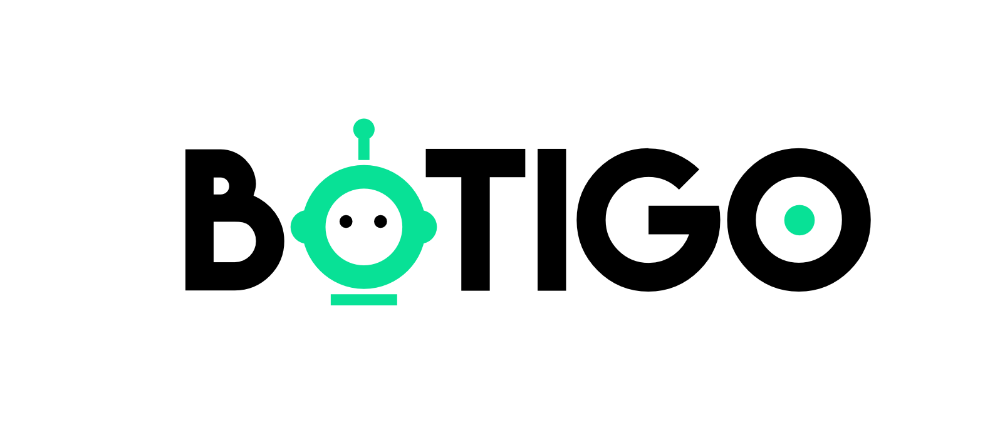

<div>
  <div align="center">
    
  </div>
<div>

# BoTigo

Facebook Messenger Bot.

## Installation

```
$ pip install requirements.txt
```

## Development

```sh
$ docker-compose up -d
$ docker exec -it botigo_server_1 bash
```

Then you can launch the app :
```sh
$ python botigo/main.py
```

## Heroku deployment

See [Heroku setup instructions](https://github.com/axelbellec/BoTigo/blob/master/heroku_setup.md).
